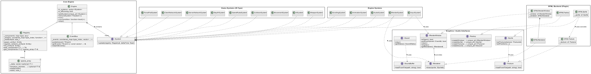

Architecture
============

*High-level architecture:*

- The **Engine** is the foundation, providing generic services and interfaces.
- A **Backend Plugin** (like SFMLBackend) implements these interfaces.
- The **Server** maintains the authoritative world state, while the **Client** renders it using the loaded backend.

This "pluggable" architecture ensures that the core engine is never dependent on a specific rendering technology.

---

Engine Core
-----------

The *Entity Component System* (**ECS**) decouples data from logic, improving scalability and maintainability.

*Core Classes:*
- `Registry` — A powerful container for all entities and components, designed to be type-safe and efficient.
- `Engine` — The main loop orchestrator. It manages a list of `ISystem` and calls their `update` method at a fixed rate.
- `EventBus` — A communication channel allowing systems to interact in a decoupled manner.
- `PluginLoader` — A utility class responsible for loading shared libraries (`.so`/`.dll`/`.dylib`) at runtime.

*Example:* How the Engine runs systems

.. code-block:: cpp

   void Engine::run(std::function<bool()> condition) {
       // ... time management (deltaTime) ...
       while (m_isRunning && condition()) {
           // ...
           for (const auto& system : m_systems) {
               // The Engine calls update on each registered system
               system->update(registry, deltaTime);
           }
       }
   }

    void Engine::run(std::function<bool()> condition) {
        const std::chrono::duration<float> timeStep(1.0f / 60.0f); // 60 ticks/sec
            // ... time management (deltaTime) ...

        while (m_isRunning) {
            auto currentTime = std::chrono::steady_clock::now();
                // ... time management (deltaTime) ...

            while (accumulator >= timeStep.count()) {
                for (const auto& system : m_systems) {
                    // The Engine calls update on each registered system
                    system->update(registry, timeStep.count());
                }
                accumulator -= timeStep.count();
            }

        }
    }

---

Graphics & Audio Abstraction
----------------------------

To achieve true modularity, the engine **never uses SFML or any other library directly**. It communicates through a set of abstract interfaces.

*Key Interfaces:*
- `IGraphicFactory` — The "master factory" responsible for creating all other concrete graphics/audio objects.
- `IRenderWindow` — An abstract representation of a window, handling events and views.
- `IRenderer` — A "drawer" that knows how to render abstract objects like `ISprite`.
- `ISprite`, `IText`, `ITexture`, `IFont` — Abstract representations of graphical objects and resources.
- `ISound`, `ISoundBuffer` — Abstract representations of audio objects.
- `IEvents` — The "ALL events" represent any possile events that can happen during the game

*Example :*
1. The `main` function loads a plugin (e.g., `SFMLBackend.so`) using the `PluginLoader`.
2. It gets an `SFMLFactory` (hidden behind an `IGraphicalFactory` interface).
3. It uses this factory to create an `IRenderWindow` and passes it to the `RenderSystem`.
4. The `RenderSystem` uses the window's `IRenderer` to `draw` an `ISprite`, without ever knowing it's dealing with SFML.

---

Game Logic (Systems & Components)
---------------------------------

Game logic is implemented in **Systems** that operate on **Components**.

**Components** are pure data structs, separated into three categories:
- **Shared:** `Position`, `Velocity`, `Health`, `Player`, `Bullet`... (known by both client and server).
- **Server-Side:** `AI_enemy`, `AIState`, `Damage`... (gameplay logic).
- **Client-Side:** `SpriteComponent`, `AnimationComponent`, `PlaySoundOnCreation`... (presentation logic).

**Systems** contain all the logic, separated by responsibility:

   * - System
     - Role
     - Location

   * - `GameRulesSystem`
     - Manages level flow and entity spawning via Lua scripts.
     - Server
   * - `AISystem`
     - Controls enemy behavior based on `AIConfig`.
     - Server
   * - `CollisionSystem`
     - Detects collisions and publishes events.
     - Server
   * - `MovementSystem`
     - Applies velocity to position for all entities.
     - Server (Shared)
   * - `ServerNetworkSyncSystem`
     - Manages clients and synchronizes the game state.
     - Server (Engine)
   * - `ClientNetworkSyncSystem`
     - Receives server state and updates the client registry.
     - Client
   * - `RenderSystem`
     - Draws all visible entities using the `IRenderer`.
     - Client (Engine)
   * - `AnimationSystem`
     - Updates sprite animations.
     - Client (Engine)
   * - `AudioSystem`
     - Plays sound effects.
     - Client (Engine)
   * - `InputSystem`
     - Translates window events into game inputs.
     - Client (Engine)

---
