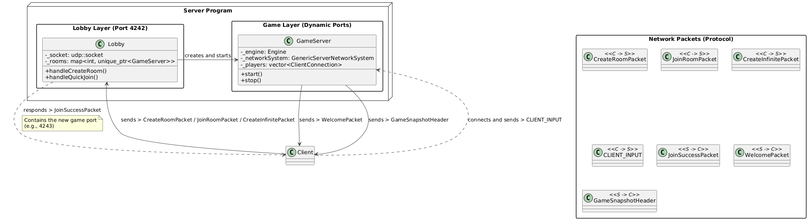

Networking
==========

NetworkSystem
-------------

The NetworkSystem in the Engine is generic; it's configured with game-specific logic in the `main`.*

The project uses a client-server architecture with a **server-authoritative model**. Communication is primarily handled via **UDP** for low latency, managed by the **ASIO** library.

Before the server for the game is lauched.We have a lobby. Whay is it?

When the lobby is launched, it waits for a connection: the client's connection. The client must send the mode in which they want to play:
infinite: for the infinite world, solo mode
create: to create their own room and wait for 3 other players before starting
join: to join an existing room or their own room while waiting for other players

*Protocol:*
- The client send a **CreateRoomPacket** or a **JoinRoomPacket** or **CreateInfinitePacket** that help the lobby to determine which mode has been choosen
- The lobby respond with a **JoinSuccessPacket** which contain the port of the server created for the corresponding mode that help the client to know that everything is good and con connect to the server port
- The server first send a  **Welcome packet** that help the client to know his id.
- The server sends a **"Snapshot of Changements"** at a fixed tick rate.
- This single packet contains all creations, destructions, and modifications that occurred during the tick.
- Each packet is numbered with a `serverTick` to allow clients to discard old or out-of-order packets.
- Client inputs are sent as small, frequent UDP packets containing a bitmask of pressed keys.

*Key Classes:*
- `ServerNetworkSyncSystems`: A configurable, engine-side system that handles the mechanics of broadcasting snapshots.
- `ClientNetworkSyncSystems`: A client-side system that receives snapshots and updates the local `Registry`.
