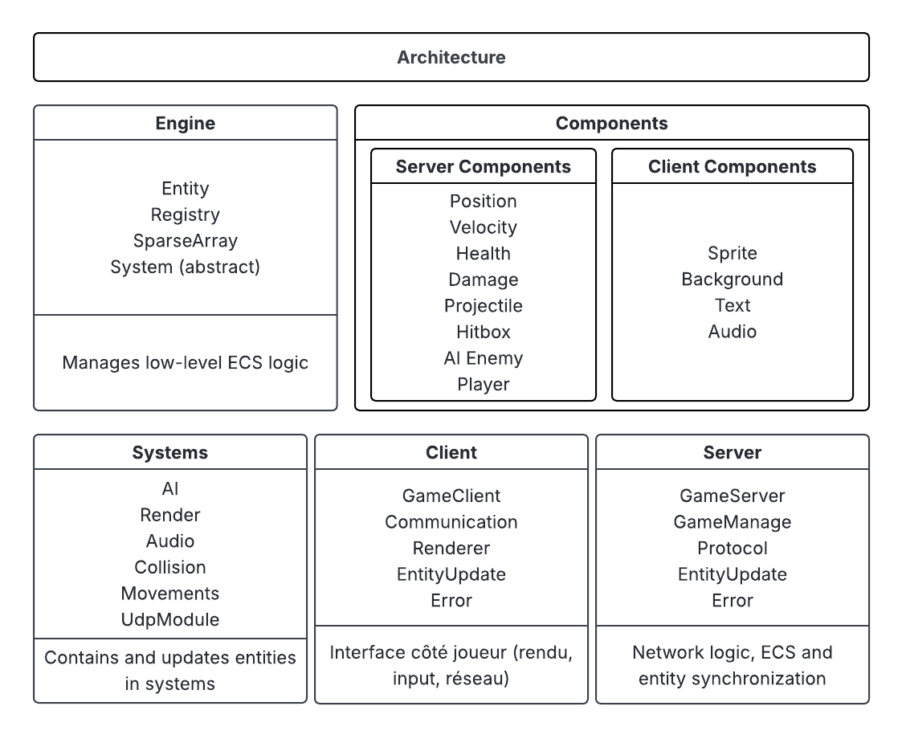

.. R-TYPE Developer Documentation master file, created by
   sphinx-quickstart on Sat Oct 11 13:24:07 2025.

==================================
R-TYPE Developer Documentation
==================================

*R-TYPE* is a multiplayer shoot’em up video game developed in *C++20*, inspired by the classic arcade game *R-Type*.
The player controls a spaceship that must defeat waves of enemies and dodge incoming projectiles.

The main goal of this project is to design a **modular, reusable, and networked game engine** using an *ECS (Entity Component System)* architecture.
A core principle of this engine is its **complete independence from any specific graphics or audio library**.

- The **Engine** provides a generic framework for creating games.
- The **Client** is a thin application that loads a **graphics backend plugin** (e.g., for SFML or SDL) to handle rendering and input.
- The **Server** is a headless application that manages game logic, synchronization, and communication via *ASIO*.

This documentation is intended for developers joining the project.
It focuses on:
- Understanding the *high-level architecture* (Engine, Backends, Game Logic).
- Knowing how to *build and run* the project.
- Following *team conventions* and *code contribution rules*.

.. toctree::
   :maxdepth: 2
   :caption: Table of Contents:

   overview
   architecture
   engine_core
   graphics_abstraction
   game_logic
   networking
   build_instructions
   comparative_study
   contribution_guide
   credits

---

Overview
========

The R-Type project is divided into **four distinct parts**:

1. **Engine (Core Library)**
   - A **static library** containing the generic heart of the project.
   - Implements the Entity Component System (`Registry`, `sparse_array`), the `Engine` loop, and the `EventBus`.
   - Contains **abstract interfaces** for graphics, audio, and input (`IGraphicsFactory`, `IRenderWindow`, `ISprite`...).

2. **Graphics/Audio Backends (Plugin Libraries)**
   - **Shared libraries** (`.so`/`.dll`/`.dylib`) that act as "translators" for a specific multimedia library.
   - Example: ``SFMLBackend`` implements the engine's abstract interfaces using SFML.
   - The engine can load any compatible backend at runtime, making it truly cross-platform and flexible.

3. **Game Logic (R-Type Specific)**
   - Contains all code specific to the R-Type game.
   - **Server Logic:** `AISystem`, `CollisionSystem`, `GameRulesSystem` (with Lua scripting), `WeaponSystem`.
   - **Client Logic:** `ClientNetworkSyncSystems`, `ScrollingSystem`.
   - **Shared Logic:** Common components (`Position`, `Health`...) and network protocol.

4. **Executables (Client & Server)**
   - Thin applications that assemble the Engine, load a backend (for the client), and add the R-Type specific game systems.

---

Architecture
============

*High-level architecture:*

- The **Engine** is the foundation, providing generic services and interfaces.
- A **Backend Plugin** (like SFMLBackend) implements these interfaces.
- The **Server** maintains the authoritative world state, while the **Client** renders it using the loaded backend.

This "pluggable" architecture ensures that the core engine is never dependent on a specific rendering technology.

---

Engine Core
===========

The *Entity Component System* (**ECS**) decouples data from logic, improving scalability and maintainability.

*Core Classes:*
- `Registry` — A powerful container for all entities and components, designed to be type-safe and efficient.
- `Engine` — The main loop orchestrator. It manages a list of `ISystem` and calls their `update` method at a fixed rate.
- `EventBus` — A communication channel allowing systems to interact in a decoupled manner.
- `PluginLoader` — A utility class responsible for loading shared libraries (`.so`/`.dll`/`.dylib`) at runtime.

*Example:* How the Engine runs systems
.. code-block:: cpp

   void Engine::run(std::function<bool()> condition) {
       // ... time management (deltaTime) ...
       while (m_isRunning && condition()) {
           // ...
           for (const auto& system : m_systems) {
               // The Engine calls update on each registered system
               system->update(registry, deltaTime);
           }
       }
   }

    void Engine::run(std::function<bool()> condition) {
        const std::chrono::duration<float> timeStep(1.0f / 60.0f); // 60 ticks/sec
            // ... time management (deltaTime) ...

        while (m_isRunning) {
            auto currentTime = std::chrono::steady_clock::now();
                // ... time management (deltaTime) ...

            while (accumulator >= timeStep.count()) {
                for (const auto& system : m_systems) {
                    // The Engine calls update on each registered system
                    system->update(registry, timeStep.count());
                }
                accumulator -= timeStep.count();
            }

        }
    }

---

Graphics & Audio Abstraction
============================

To achieve true modularity, the engine **never uses SFML or any other library directly**. It communicates through a set of abstract interfaces.

*Key Interfaces:*
- `IGraphicFactory` — The "master factory" responsible for creating all other concrete graphics/audio objects.
- `IRenderWindow` — An abstract representation of a window, handling events and views.
- `IRenderer` — A "drawer" that knows how to render abstract objects like `ISprite`.
- `ISprite`, `IText`, `ITexture`, `IFont` — Abstract representations of graphical objects and resources.
- `ISound`, `ISoundBuffer` — Abstract representations of audio objects.
- `IEvents` — The "ALL events" represent any possile events that can happen during the game

*Example :*
1. The `main` function loads a plugin (e.g., `SFMLBackend.so`) using the `PluginLoader`.
2. It gets an `SFMLFactory` (hidden behind an `IGraphicalFactory` interface).
3. It uses this factory to create an `IRenderWindow` and passes it to the `RenderSystem`.
4. The `RenderSystem` uses the window's `IRenderer` to `draw` an `ISprite`, without ever knowing it's dealing with SFML.

---

Game Logic (Systems & Components)
=================================

Game logic is implemented in **Systems** that operate on **Components**.

**Components** are pure data structs, separated into three categories:
- **Shared:** `Position`, `Velocity`, `Health`, `Player`, `Bullet`... (known by both client and server).
- **Server-Side:** `AI_enemy`, `AIState`, `Damage`... (gameplay logic).
- **Client-Side:** `SpriteComponent`, `AnimationComponent`, `PlaySoundOnCreation`... (presentation logic).

**Systems** contain all the logic, separated by responsibility:

| System                    | Role                                                    | Location          |
|---------------------------|---------------------------------------------------------|-------------------|
| `GameRulesSystem`         | Manages level flow and entity spawning via Lua scripts. | Server            |
| `AISystem`                | Controls enemy behavior based on `AIState`.             | Server            |
| `CollisionSystem`         | Detects collisions and publishes events.                | Server            |
| `MovementSystem`          | Applies velocity to position for all entities.          | Server (Shared)   |
| `ServerNetworkSyncSystems`| Manages clients and synchronizes the game state.        | Server            |
| `ClientNetworkSyncSystems`| Receives server state and updates the client registry.  | Client            |
| `RenderSystem`            | Draws all visible entities using the `IRenderer`.       | Client            |
| `AnimationSystem`         | Updates sprite animations.                              | Client            |
| `AudioSystem`             | Plays sound effects.                                    | Client            |
| `InputSystem`             | Translates window events into game inputs.              | Client            |

*(*) The NetworkSystem in the Engine is generic; it's configured with game-specific logic in the `main`.*

---

Networking
==========

The project uses a client-server architecture with a **server-authoritative model**. Communication is primarily handled via **UDP** for low latency, managed by the **ASIO** library.
But before that we have the **TCP** manage by **ASIO** too, that help especially in the menu part. It help in the lobby.

*Protocol:*
- The server first send a  **Welcome packet** that help the client to know his id.
- The server sends a **"Snapshot of Changements"** at a fixed tick rate.
- This single packet contains all creations, destructions, and modifications that occurred during the tick.
- Each packet is numbered with a `serverTick` to allow clients to discard old or out-of-order packets.
- Client inputs are sent as small, frequent UDP packets containing a bitmask of pressed keys.

.. image:: _static/network_diagram.png
   :align: center
   :alt: Networking Data Flow
   :width: 75%

*Key Classes:*
- `ServerNetworkSyncSystems`: A configurable, engine-side system that handles the mechanics of broadcasting snapshots.
- `ClientNetworkSyncSystems`: A client-side system that receives snapshots and updates the local `Registry`.

Comparative & Technical Study
=============================

**Languages:**
- Chosen: **C++20**
  - Enables templates, type-safety, and high-performance ECS patterns.
- Alternatives: **Rust**, **C# (Unity ECS)**
  - Rust ensures memory safety but has a smaller ecosystem.
  - Unity is simpler but less customizable.

**Libraries:**
- **SFML** (graphics, sound, input)
  - Chosen for its simplicity and cross-platform support.
- **ASIO** (network)
  - Lightweight, non-blocking, ideal for real-time UDP communication.
- **Conan** (dependency manager)
  - Automates cross-platform builds for both server and client.

**Design Patterns:**
- ECS Pattern for modularity.  
- Factory Pattern for entity creation.  
- Observer/Event system for state synchronization.

---

Contribution & Coding Guidelines
================================

**Code Style:**
- Follow **Epitech C++ standard** (header guards, naming, formatting).  
- Each system and component has its own `.hpp` and `.cpp`.

**Commit Rules:**
- Clear, imperative messages:  
  Example: `feat(network): add packet serialization`

**Branch Naming:**
- `feature/<feature-name>` for new features  
- `fix/<issue-name>` for bug fixes

**Documentation:**
- Update **Sphinx docs** when adding systems or architecture changes.

**Example Workflow:**
1. `git checkout -b feature/movement-system`
2. Implement + test locally
3. Update docs and run `make html`
4. Open Pull Request

---

Build Instructions
==================

1. **Configure and build:**

   .. code-block:: bash

      mkdir build && cd build
      cmake ..
      make

2. **Run the server:**

   .. code-block:: bash

      ./r-type_server port

3. **Run the client:**

   .. code-block:: bash

      ./r-type_client addresse_IP port

---

Credits
=======

**Developers:**  
- Océane **KODJELA** — ECS Engine & Systems  
- Zoltan **BABKO** — Networking & Server  
- Aurel **PLIYA**, Paul **MOURENS**, Vlad **BURGA** — Client & Graphics  

Developed as part of **Epitech G-CPP-500 (2025)**.

